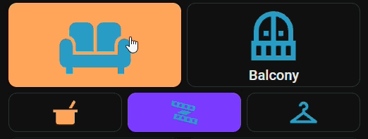
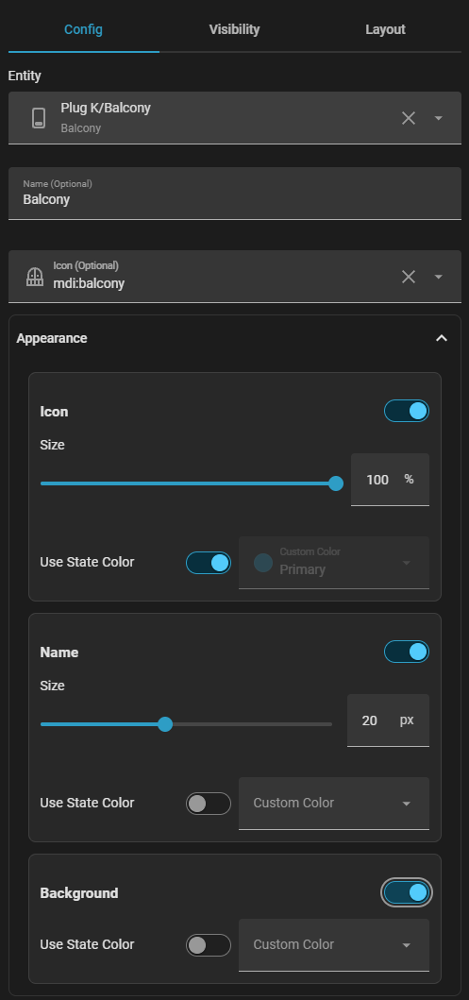
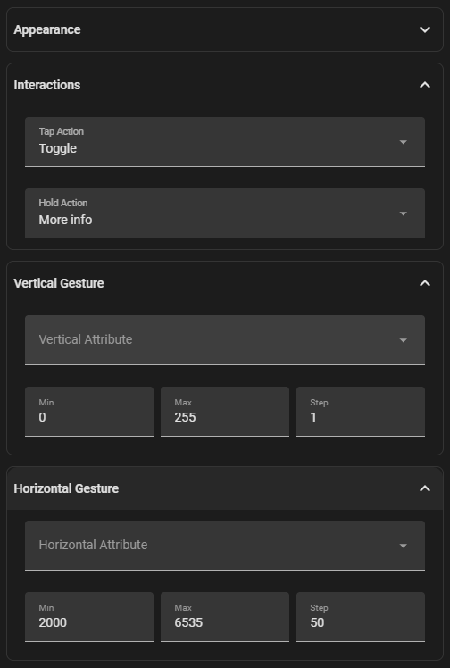

# Gesture Card

A feature-rich, fully visual Lovelace card for Home Assistant that adds vertical and horizontal touch gestures to your dashboard tiles.

## Key Features

* Native UI editor support for complete visual configuration without requiring manual YAML editing.
* Interactive two-dimensional swiping to adjust entity attributes like brightness, position, or volume in real time.
* Highly customizable visual elements including independent icon sizing, label typography, and state-based color adjustments.
* Integrated support for standard tap and hold actions alongside directional swipe gestures.

## Configuration Guide

### Appearance Options

The card editor provides complete control over how your tiles look and react to entity state updates.

* Entity selection binds state and control properties to any Home Assistant device.
* Icon settings allow scaling percentages, state-based coloring, or fixed custom colors.
* Name configuration supports custom text labels, pixel font sizes, and state coloring.
* Background options enable dynamic state-based hues or static custom colors.

### Interactions and Gestures

You can configure separate control paths for standard presses and directional swipe gestures.

* Tap actions define standard Lovelace click behaviors like toggling state or opening detail dialogs.
* Hold actions allow long-press interactions to trigger scripts or secondary controls.
* Vertical gestures map up and down swiping to an attribute with custom minimum, maximum, and step bounds.
* Horizontal gestures map left and right swiping to a secondary attribute with distinct numerical limits.

## Installation

Add this repository as a custom repository in HACS under the **Plugin** category, then search for **Gesture Card** to download it.

## Note

This is my very first custom Home Assistant card, built with the assistance of ai to help design, structure, and implement the codebase. Feedback and contributions are always welcome.
